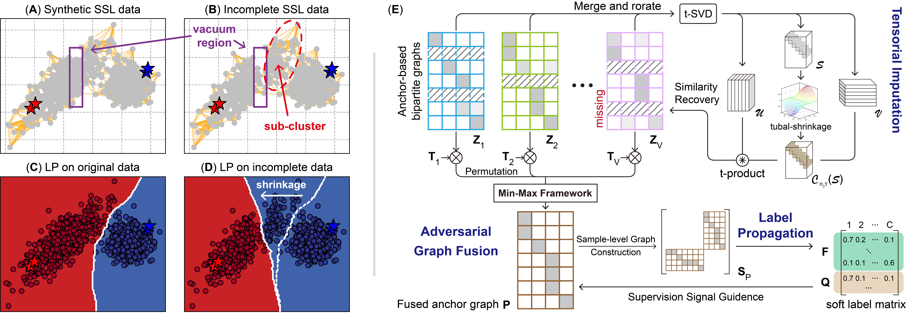

# Adversarial Graph Fusion for Incomplete Multi-view Semi-supervised Learning with Tensorial Imputation
## 💭 Sub-Cluster Problem


We observe that the view missing issue will incur unreliable neighbor relationships, thus breaking the key _smoothness assumption_ in label propagation (LP).
As shown in subfigures (A) and (B), missing samples in each view may generate multiple ''vacuum regions'' that fragment a complete category cluster into several _sub-clusters_, thereby distorting the smooth local structure on the common manifold. We term this phenomenon the **S**ub-**C**luster **P**roblem (SCP).
Comparing subfigures (C) and (D), one could observe that SCP impedes the propagation of red label information to its corresponding sub-cluster, erroneously making the decision boundary recede into the vacuum region.

## 🌔 AGF-TI
### Requirements
- MATLAB 2022a (64-bit)

### Content
- `AGF_TI.m`: the proposed **AGF-TI** method, whose optimization procedure is summarized in Algorithm 2.
- `AGF_TI_grad.m`: calculate the reduced gradient $\mathbf{g}$.
- `AGF_TI_cost.m`: update the fused bipartite graph $\mathbf{P}$ and compute the cost for optimal step length search $\theta$.
- `AGF_TI_update.m`: the implementation of the optimal step length search process and update the view weight coefficients $\boldsymbol{\alpha}$.


### Usage
To classify the unlabeled instances in the incomplete multi-view semi-supervised learning task, you can run the following command in MATLAB:

```matlab
[Ypred, Out] = AGF_TI(tensor_Z, num_class, Ll, existing_index, params)
```


#### The inputs of the `AGF_TI` function are:

- **tensor_Z**: third-order tensor of the bipartite graphs $\mathcal{Z}$, $(n, m, V)$.
- **num_class**: the number of classes, $c$.
- **Ll**: the label set of the labeled instances, $\{y_i{\in}[c]\}_{i=1}^\ell$.
- **existing_index**: the indicator matrix of size $n \times V$ to present the missing instance in each view, $\{\pi_v, \omega_v\}_{v=1}^V$.
- **params**: structure, parameters for the `AGF-TI` method, including:
    - *params.maxIter*: int, maximum number of iterations.
    - *params.lambda*: float, the trade-off parameter for the AGF.
    - *params.beta*: float, $\beta_\lambda$.
    - *params.rho*: float, the trade-off parameter for the Tensor Nuclear Norm.
    - *params.seuildiffsigma*: float, the threshold for convergence of Algorithm 1.
    - *params.epson*: float, the threshold for convergence of Algorithm 2.
    - *params.goldensearch_deltmax*: float, the initial precision of golden section search.
    - *params.numericalprecision*: float, the numerical precision weights below this value.
    - *params.firstbasevariable*: string, the tie breaking method for choosing the base.


#### The outputs of the `AGF_TI` function are:
- **Ypred**: the predicted labels of the unlabeled instances, $(n-\ell, 1)$
- **Out**: struct, the output of the algorithm
    - *Out.F*: the final representation of the fused labeled and unlabeled instances, $(n, c)$
    - *Out.Q*: the final representation of the fused anchors, $(m, c)$
    - *Out.alpha*: the final weights of the views, $(V, 1)$


### Datasets
More datasets can be found [here](https://github.com/ZhangqiJiang07/Multi-view_Multi-class_Datasets).
